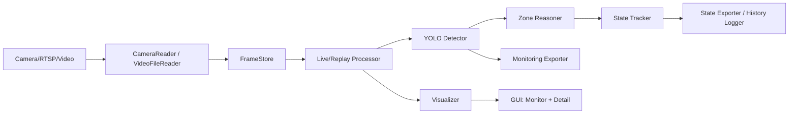
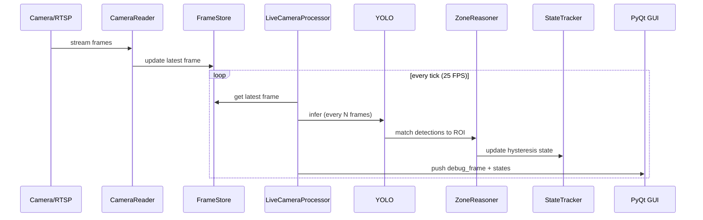

# PIDVN25006 — CCTV AGV Vision Monitoring (Version 1)

Ngày cập nhật: 2026-03-15

Mục tiêu: Hệ thống giám sát realtime (25 FPS) cho camera AGV/AMR, nhận diện trolley/pallet theo ROI, hiển thị trạng thái trực quan và xuất JSON phục vụ điều lệnh.  
Triết lý bắt buộc: **simple + deterministic + observable + fail-safe**.

---

## 1) Tổng quan hệ thống
- Realtime multi-camera (origin view + processed view).
- Detection YOLO + Zone reasoning + State tracking (hysteresis).
- GUI giám sát và detail view theo từng camera.
- Xuất snapshot JSON cho AGV/monitoring/log.
- Fail-safe: dữ liệu stale/unknown ⇒ **hold/unknown**, không phát lệnh nguy hiểm.

## 2) Sơ đồ kiến trúc


## 3) Luồng xử lý chính (runtime)


---

## 4) Thành phần chính
- `main_monitor_gui.py`: GUI đa camera (processed view + state snapshot).
- `main_origin_monitor_gui.py`: GUI origin view + detail window realtime.
- `core/camera_reader.py`: RTSP reader low-latency.
- `core/live_camera_processor.py`: pipeline detection + state.
- `core/replay_camera_processor.py`: replay video file.
- `core/state_tracker.py`: hysteresis enter/exit logic.
- `core/zone_reasoner.py`: match bbox vào ROI polygon.
- `core/visualizer.py`: vẽ ROI + bbox.
- `core/logger_config.py`: logging chuẩn hóa.

---

## 5) Cấu hình quan trọng
### 5.1 `configs/cameras.json`
- `camera_id`, `camera_type`, `source_type`, `source_path`
- `model_path`, `zone_config`, `infer_every_n_frames`

### 5.2 `configs/rules.json`
- `spatial_method`: `bbox_center` hoặc `bbox_all_corners`
- `enter_window`, `enter_count`, `exit_window`, `exit_count`
- `unknown_timeout_sec`, `conf_threshold`, `img_size`
- `batch_size`, `batch_timeout_ms`

### 5.3 `configs/gui.json`
- `source_fps`: 25
- `grid_rows`, `grid_cols`
- `cell_min_width`, `cell_min_height`
- `max_result_staleness_sec`: ngưỡng stale (fail-safe)
- `metrics_log_interval_sec`: chu kỳ log metrics

### 5.4 `configs/zones_camXXX.json`
- Danh sách ROI polygon (normalized 0–1)
- `zone_id`, `target_object`

---

## 6) Hướng dẫn chạy chương trình
### 6.1 Chạy GUI monitor (processed view)
```bash
python main_monitor_gui.py
```

### 6.2 Chạy GUI origin + detail
```bash
python main_origin_monitor_gui.py
```

### 6.3 Replay video file (single/multi)
```bash
python app/main_replay.py
python app/main_replay_multi.py
```

### 6.4 Auto-restart (supervisor)
```bash
python supervisor.py
```

---

## 7) Debug và log
- `outputs/history/*_history.jsonl`: log trạng thái.
- `outputs/multi_runtime/*_latest.json`: snapshot state.
- `outputs/monitoring/*_latest_detection.json`: detection snapshot.
- `outputs/agv/agv_latest.json`: payload tổng hợp cho AGV.

Log file:
- Linux: `~/.config/PIDVN25006/logs/app.log`
- Windows: `%APPDATA%\PIDVN25006\logs\app.log`

Metrics per camera (log định kỳ):
- `fps`, `detect_p95`, `unknown_ratio`, `reconnects`

---

## 8) RTSP low-latency
Đã bật:
- Buffer tối thiểu.
- FFmpeg options: `fflags=nobuffer`, `low_delay`, `reorder_queue_size=0`.

Hỗ trợ biến môi trường trong `cameras.json`:
```
rtsp://user:${RTSP_PASS}@ip:port/Streaming/Channels/101
```

---

## 9) Fail-safe output policy (AGV)
Một camera sẽ **hold** nếu:
- `timestamp` stale > `max_result_staleness_sec`
- `camera_health` != `online`
- Có bất kỳ zone state = `unknown`

Payload AGV bao gồm:
- `health`, `hold`, `states`, `detections`

---

## 10) Triển khai Linux (production)
### 10.1 Tạo môi trường
```bash
python3 -m venv .venv
source .venv/bin/activate
pip install -U pip
pip install -r requirements.txt
```

### 10.2 Cài hệ phụ trợ (khuyến nghị)
```bash
sudo apt-get update
sudo apt-get install -y ffmpeg libgl1 libglib2.0-0
```

### 10.3 Cài PyTorch phù hợp GPU
- CPU: `pip install torch torchvision`
- CUDA: dùng lệnh theo hướng dẫn chính thức của PyTorch.

### 10.4 Systemd service (khuyến nghị)
Tạo file `/etc/systemd/system/pidvn25006.service`:
```ini
[Unit]
Description=PIDVN25006 Monitor
After=network.target

[Service]
Type=simple
WorkingDirectory=/opt/pidvn25006
ExecStart=/opt/pidvn25006/.venv/bin/python /opt/pidvn25006/main_monitor_gui.py
Restart=always
RestartSec=5
Environment=PYTHONUNBUFFERED=1

[Install]
WantedBy=multi-user.target
```

Kích hoạt:
```bash
sudo systemctl daemon-reload
sudo systemctl enable pidvn25006
sudo systemctl start pidvn25006
sudo systemctl status pidvn25006
```

---

## 11) Checklist vận hành tại nhà máy
- RTSP delay < 300 ms.
- 25 FPS ổn định 10 phút liên tục.
- Origin và processed view không drift.
- Log không lỗi, không tăng bất thường.
- Fail-safe: stale/unknown ⇒ hold.
