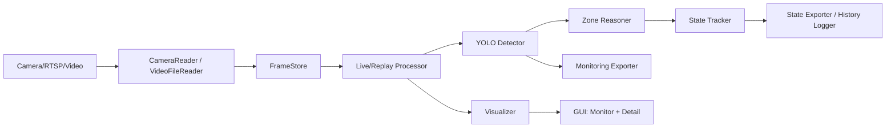
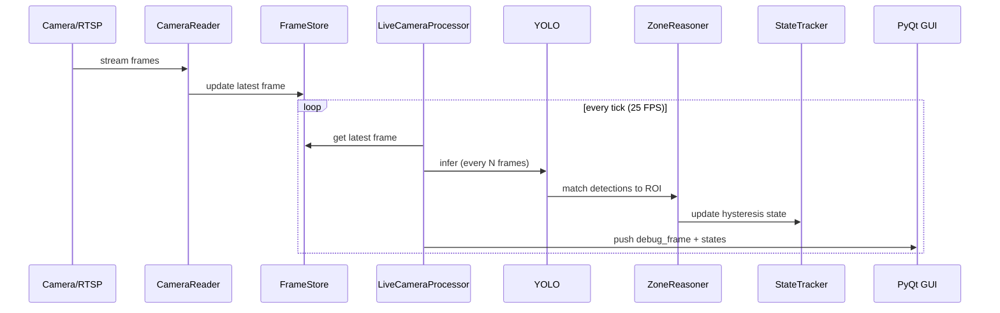

# RTC TECHNOLOGY - DỰ ÁN PID.25.006 - CCTV VISION MONITOR - Made by Nguyen Hai Long - R0352 - Techinical Intern (Vision)
# Project Name: PIDVN25006 — CCTV AGV-Vision Monitoring (Version 1)

Ngày cập nhật: 2026-03-14

Mục tiêu: Hệ thống giám sát realtime (25 FPS) cho camera AGV, nhận diện trolley/pallet theo vùng ROI, hiển thị trạng thái trực quan và xuất JSON tích hợp nhà máy.

## Tổng quan hệ thống
- Realtime multi-camera (origin view + processed view).
- Detection YOLO + Zone reasoning + State tracking (hysteresis).
- GUI giám sát và detail view theo từng camera.
- Xuất snapshot JSON cho AGV/monitoring/log.

## Sơ đồ kiến trúc


## Luồng xử lý chính (runtime)


## Thành phần chính
- `main_monitor_gui.py`: GUI đa camera (processed view + state snapshot).
- `main_origin_monitor_gui.py`: GUI origin view + detail window realtime.
- `core/camera_reader.py`: RTSP reader low-latency.
- `core/live_camera_processor.py`: pipeline detection + state.
- `core/replay_camera_processor.py`: replay video file.
- `core/state_tracker.py`: hysteresis enter/exit logic.
- `core/zone_reasoner.py`: match bbox vào ROI polygon.
- `core/visualizer.py`: vẽ ROI + bbox.

## Cấu hình quan trọng
1) `configs/cameras.json`
- `camera_id`, `camera_type`, `source_type`, `source_path`
- `model_path`, `zone_config`, `infer_every_n_frames`

2) `configs/rules.json`
- `spatial_method`: `bbox_center` hoặc `bbox_all_corners`
- `enter_window`, `enter_count`, `exit_window`, `exit_count`
- `unknown_timeout_sec`, `conf_threshold`, `img_size`
- `batch_size`, `batch_timeout_ms`

3) `configs/gui.json`
- `source_fps`: 25
- `grid_rows`, `grid_cols`
- `cell_min_width`, `cell_min_height`

4) `configs/zones_camXXX.json`
- Danh sách ROI polygon (normalized 0–1)
- `zone_id`, `target_object`

## Hướng dẫn chạy chương trình
### 1) Chạy GUI monitor (processed view)
```bash
python main_monitor_gui.py
```

### 2) Chạy GUI origin + detail
```bash
python main_origin_monitor_gui.py
```

### 3) Replay video file (single/multi)
```bash
python app/main_replay.py
python app/main_replay_multi.py
```

### 4) Chạy auto-restart (supervisor)
```bash
python supervisor.py
```

## Debug và log
- `outputs/history/*_history.jsonl`: log trạng thái.
- `outputs/multi_runtime/*_latest.json`: snapshot state.
- `outputs/monitoring/*_latest_detection.json`: detection snapshot.
- `outputs/agv/agv_latest.json`: payload tổng hợp cho AGV.
- Log file mặc định: `~/.config/PIDVN25006/logs/app.log` (Linux) hoặc `%APPDATA%\\PIDVN25006\\logs\\app.log` (Windows).

## RTSP low-latency (v1 đã bật)
- Buffer tối thiểu.
- FFmpeg options: `fflags=nobuffer`, `low_delay`, `reorder_queue_size=0`.

## Hiệu năng
- `infer_every_n_frames` quyết định tần suất detection.
- `detect_ms` hiển thị trong detail window.
- `batch_size` và `batch_timeout_ms` tối ưu throughput khi nhiều camera.

## Triển khai Linux (production)
### 1) Tạo môi trường
```bash
python3 -m venv .venv
source .venv/bin/activate
pip install -U pip
pip install -r requirements.txt
```

### 2) Cài hệ phụ trợ (khuyến nghị)
```bash
sudo apt-get update
sudo apt-get install -y ffmpeg libgl1 libglib2.0-0
```

### 3) Cài PyTorch phù hợp GPU
- CPU: `pip install torch torchvision`
- CUDA: dùng lệnh theo hướng dẫn chính thức của PyTorch.

### 4) Chạy dịch vụ systemd (khuyến nghị)
Tạo file service `/etc/systemd/system/pidvn25006.service`:
```ini
[Unit]
Description=PIDVN25006 Monitor
After=network.target

[Service]
Type=simple
WorkingDirectory=/opt/pidvn25006
ExecStart=/opt/pidvn25006/.venv/bin/python /opt/pidvn25006/main_monitor_gui.py
Restart=always
RestartSec=5
Environment=PYTHONUNBUFFERED=1

[Install]
WantedBy=multi-user.target
```

Kích hoạt:
```bash
sudo systemctl daemon-reload
sudo systemctl enable pidvn25006
sudo systemctl start pidvn25006
sudo systemctl status pidvn25006
```

## Audit v1 (đã fix)
- Detail window realtime đồng bộ với origin.
- UI timer bám 25 FPS.
- RTSP giảm trễ (low-latency + buffer thấp).

## Roadmap v2 (gọn, có căn cứ)
1) RTSP latency
- Backend GStreamer/FFmpeg chuyên dụng nếu cần <200 ms.
- Drop frame nếu backlog > 1.

2) Batching
- `batch_size` 2–4 cho multi-camera.
- Tối ưu `batch_timeout_ms`.

3) Zone logic
- Multi-object rule trong ROI.
- Occlusion filter (bbox nhỏ/không ổn định).
- Temporal smoothing trên score.

## Checklist kiểm tra tại nhà máy
- Delay RTSP < 300 ms.
- 25 FPS ổn định 10 phút liên tục.
- Origin và processed view không drift.
- Log không lỗi, không tăng bất thường.
