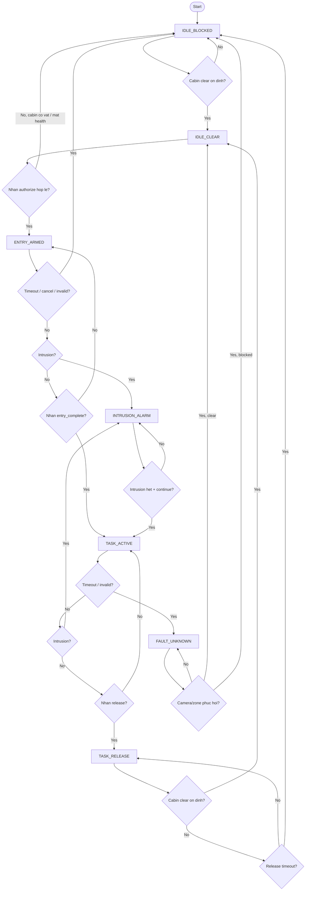
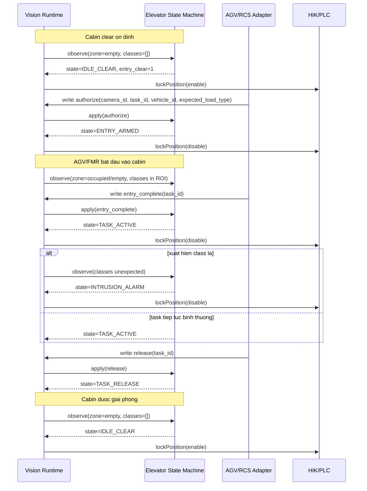

# Elevator Process Workflow

## 1. Muc tieu

Tai lieu nay mo ta luong process thang may da duoc bo sung vao runtime Vision hien tai cho:

- `cam6`: thang may AMR + pallet
- `cam7`: thang may FMR/Forklift + trolley

Muc tieu cua process nay:

- khong them pipeline infer moi
- khong tang tai GPU dang ke
- giu fail-safe nghiem ngat
- tach `zone occupancy` khoi `workflow logic`
- cho phep ket noi command tu AGV/RCS theo kieu event-driven

## 2. Kien truc toi gian

Luong xu ly moi:

`Camera -> Reader -> YOLO batch inference -> ZoneReasoner -> StateTracker -> ElevatorStateMachine -> Runtime Snapshot -> HIK/RCS/PLC`

Trong do:

- `ZoneReasoner` va `StateTracker` van giu vai tro goc
- `ElevatorStateMachine` chi doc output da co san
- khong mo them camera, khong them model, khong infer them lan nao nua

## 3. File lien quan

### 3.1 File moi

- `configs/elevator.json`
- `core/elevator_types.py`
- `core/elevator_state_machine.py`
- `core/elevator_runtime.py`
- `tools/elevator_cmd.py`
- `docs/elevator_process_vi.md`

### 3.2 File da sua

- `mainProcess.py`
- `core/runtime_bridge.py`
- `configs/cameras.json`

## 4. Input cua process

### 4.1 Input tu Vision runtime

Moi chu ky export, elevator runtime doc:

- `camera_id`
- `camera_health`
- `timestamp`
- `zone state` cua `LIFT_1` hoac `LIFT_2`
- `detected_classes` nam trong ROI thang may

`detected_classes` duoc loc theo dung ROI elevator, khong lay toan frame.

### 4.2 Input command tu AGV/RCS

Command file mac dinh:

- `outputs/runtime/elevator_commands.json`

Moi command gom:

- `sequence`
- `camera_id`
- `command`
- `task_id`
- `vehicle_id`
- `expected_load_type`
- `timestamp`

Command hop le:

- `authorize`
- `entry_complete`
- `release`
- `continue`
- `cancel`

## 5. Output cua process

### 5.1 Snapshot rieng cho tung thang may

- `outputs/runtime/elevator/cameras/cam6.json`
- `outputs/runtime/elevator/cameras/cam7.json`

### 5.2 Snapshot tong

- `outputs/runtime/elevator_latest.json`

### 5.3 Output tong hop trong process snapshot

- `outputs/runtime/process_latest.json`

Truong bo sung:

- `elevators`

### 5.4 Output su dung cho HIK bridge

Khi HIK sync chay:

- elevator khong con gui `zone occupancy` thang may thuan tuy nua
- HIK se nhan `zone state` da qua workflow logic
- `IDLE_CLEAR` -> `empty`
- cac state con lai -> `occupied`
- neu fault -> `unknown`

Tu duy nay dung cho use-case `lockPosition`:

- chi khi cabin san sang cho entry moi `enable`
- dang task active, dang armed, dang release, dang fault -> van phai `disable`

## 6. State machine

### 6.1 State list

- `IDLE_BLOCKED`
- `IDLE_CLEAR`
- `ENTRY_ARMED`
- `TASK_ACTIVE`
- `INTRUSION_ALARM`
- `TASK_RELEASE`
- `FAULT_UNKNOWN`

### 6.2 Y nghia

`IDLE_BLOCKED`

- Cabin chua clear, hoac startup chua du tin cay, hoac co vat trong cabin.

`IDLE_CLEAR`

- Cabin clear on dinh, cho phep cap quyen cho AGV/FMR vao.

`ENTRY_ARMED`

- Da nhan `authorize`, task duoc cap quyen vao cabin.

`TASK_ACTIVE`

- Da nhan `entry_complete`, task dang hoat dong trong cabin.

`INTRUSION_ALARM`

- Trong `ENTRY_ARMED` hoac `TASK_ACTIVE`, phat hien class ngoai expected set.

`TASK_RELEASE`

- Da nhan `release`, cho AGV/FMR roi cabin.

`FAULT_UNKNOWN`

- Camera stale/offline, zone invalid, timeout nghiem trong, hoac mat tinh chac chan.

## 7. Transition rules

### 7.1 Chuyen state chinh

- `IDLE_BLOCKED -> IDLE_CLEAR`
  - zone `empty` on dinh >= `clear_stable_sec`
- `IDLE_CLEAR -> ENTRY_ARMED`
  - nhan `authorize`
  - camera san sang
  - zone dang `empty`
  - `task_id` bat buoc co
- `ENTRY_ARMED -> TASK_ACTIVE`
  - nhan `entry_complete`
  - `task_id` khop token
- `TASK_ACTIVE -> TASK_RELEASE`
  - nhan `release`
  - `task_id` khop token
- `INTRUSION_ALARM -> TASK_ACTIVE`
  - intrusion bien mat du lau >= `intrusion_hold_sec`
  - nhan `continue`
  - `task_id` khop token
- `TASK_RELEASE -> IDLE_CLEAR`
  - zone `empty` on dinh >= `clear_stable_sec`

### 7.2 Chuyen fail-safe

- observation invalid -> `FAULT_UNKNOWN` hoac `IDLE_BLOCKED`
- `ENTRY_ARMED` timeout -> `IDLE_BLOCKED`
- `TASK_ACTIVE` timeout -> `FAULT_UNKNOWN`
- `TASK_RELEASE` timeout -> `IDLE_BLOCKED`
- `cancel` -> xoa token, quay ve `IDLE_CLEAR` neu cabin clear, nguoc lai `IDLE_BLOCKED`

## 8. Flowchart



## 9. Sequence diagram



## 10. Config guide

### 10.1 `configs/elevator.json`

Moi lift co:

- `enabled`
- `camera_id`
- `zone_id`
- `lift_id`
- `workflow_type`
- `default_expected_load_type`
- `allowed_detection_classes`
- `clear_stable_sec`
- `entry_arm_timeout_sec`
- `task_active_timeout_sec`
- `release_timeout_sec`
- `intrusion_hold_sec`
- `unknown_timeout_sec`
- `fail_safe_on_camera_offline`

Khuyen nghi:

- `cam6`: `enabled=true`
- `cam7`: giu `enabled=false` cho toi khi onsite san sang

## 11. Cach gui command

### 11.1 Tool test local

Dung:

```bash
python tools/elevator_cmd.py authorize --camera-id cam6 --task-id TASK001 --vehicle-id AMR01 --expected-load-type pallet
python tools/elevator_cmd.py entry_complete --camera-id cam6 --task-id TASK001
python tools/elevator_cmd.py release --camera-id cam6 --task-id TASK001
python tools/elevator_cmd.py cancel --camera-id cam6 --task-id TASK001
```

Neu may khong co `python` trong PATH, dung interpreter phu hop cua site.

### 11.2 Quy tac command

- `sequence` phai tang dan
- command writer nen append queue, khong duoc xoa command cu chua xu ly
- `authorize` bat buoc co `task_id`
- `expected_load_type` phai nam trong `allowed_detection_classes`

## 12. Cach doc snapshot

Vi du `cam6.json` se co:

- `lift_state`
- `safety_ok`
- `entry_clear`
- `intrusion_alarm`
- `fault_code`
- `task_id`
- `vehicle_id`
- `expected_load_type`
- `detected_classes`
- `last_command_name`
- `last_command_status`
- `last_command_reason`

## 13. Quy tac fail-safe

- Startup mac dinh `IDLE_BLOCKED`
- Camera offline/stale -> `FAULT_UNKNOWN` hoac blocked safe state
- `unknown` khong bao gio duoc suy ra `entry_clear`
- timeout thi phai roi ve safe state
- intrusion chi duoc resume bang `continue`
- command sai state bi reject va co ly do ro rang

## 14. Checklist commissioning

### 14.1 Truoc khi live

- xac nhan ROI `LIFT_1`, `LIFT_2`
- xac nhan class detect that cua model:
  - `pallet`
  - `trolley`
  - neu co them `person`, `obstacle`
- xac nhan AGV/RCS adapter gui dung 5 command workflow
- xac nhan `sequence` command tang dan

### 14.2 Test logic co ban

1. Cabin dang co vat -> state phai la `IDLE_BLOCKED`
2. Cabin clear on dinh -> state phai len `IDLE_CLEAR`
3. Gui `authorize` hop le -> `ENTRY_ARMED`
4. Gui `entry_complete` -> `TASK_ACTIVE`
5. Cho class la vao ROI -> `INTRUSION_ALARM`
6. Het intrusion + gui `continue` -> `TASK_ACTIVE`
7. Gui `release` -> `TASK_RELEASE`
8. Cabin clear on dinh -> `IDLE_CLEAR`

### 14.3 Test fail-safe

1. Rut camera / mat stream -> phai blocked/fault
2. Khong gui `entry_complete` -> `entry_arm_timeout`
3. Khong gui `release` -> `task_active_timeout` hoac chinh sach fault
4. Sau `release`, cabin khong clear -> `release_timeout`

## 15. Ghi chu quan trong

- Logic nay moi la phase 1 toi gian, dung de chot workflow va commissioning.
- No khong them semantic detector moi.
- Neu sau nay can nhan dien AGV/FMR rieng hoan chinh hon, co the mo rong policy ma khong pha pipeline hien tai.
