# Tổng hợp kiến trúc hệ thống và toàn bộ lưu đồ xử lý

## 1. Mục đích của tài liệu

Tài liệu này dùng để trình bày đầy đủ bức tranh hệ thống Vision hiện tại của dự án, theo đúng tinh thần:

- phải nhìn ra được tư duy xây dựng hệ thống
- phải thấy rõ luồng dữ liệu đi như thế nào
- phải hiểu rõ từng tầng xử lý đảm nhận vai trò gì
- phải nhìn được các điểm fail-safe quan trọng
- phải thấy được cách hệ thống tối ưu tài nguyên để chạy nhiều camera

Tài liệu này không đi sâu vào từng dòng code, mà tập trung vào:

- kiến trúc tổng thể
- lưu đồ thuật toán
- lưu đồ tuần tự
- nguyên tắc điều phối toàn hệ thống
- cách hệ thống ra quyết định

## 2. Tư duy thiết kế tổng thể của hệ thống

Hệ thống được xây dựng theo tư duy phân tầng rất rõ ràng. Mỗi tầng chỉ làm đúng một nhóm nhiệm vụ của nó.

### 2.1. Tầng thu nhận dữ liệu

Nhiệm vụ:

- đọc luồng RTSP hoặc video
- duy trì `latest frame`
- tự reconnect khi mất tín hiệu
- không cho frame cũ tích tụ thành hàng đợi dài

Ý nghĩa:

- ưu tiên độ trễ thấp
- tránh nghẽn pipeline
- đảm bảo backend luôn xử lý trên khung hình mới nhất, không xử lý đuổi theo lịch sử

### 2.2. Tầng nhận thức thị giác

Nhiệm vụ:

- gom các camera đến hạn suy luận
- chạy batch YOLO
- chuyển detection thành thông tin “ROI có object mục tiêu hay không”

Ý nghĩa:

- dùng GPU hiệu quả hơn
- tách `nhìn thấy gì` khỏi `quyết định nghiệp vụ`
- giữ phần thị giác ở mức cảm biến đầu vào

### 2.3. Tầng ổn định trạng thái và ra quyết định

Nhiệm vụ:

- làm mượt `occupied / empty / unknown`
- ổn định mốc `occupied_since`
- áp logic workflow thang máy
- biến perception thành tín hiệu điều khiển an toàn

Ý nghĩa:

- đây là nơi biến detection frame-level thành quyết định mức hệ thống
- fail-safe phải nằm ở tầng này, không được chờ tới giao diện hay bridge ngoài

### 2.4. Tầng tích hợp và hiển thị

Nhiệm vụ:

- xuất snapshot runtime
- đồng bộ trạng thái sang HIK RCS
- cung cấp dữ liệu cho GUI
- ghi log lịch sử và dọn log định kỳ

Ý nghĩa:

- GUI chỉ là lớp hiển thị
- HIK/AGV chỉ nhận kết quả đã qua xử lý
- backend là nguồn sự thật duy nhất của hệ thống

## 3. Các nguyên tắc kiến trúc cốt lõi

### 3.1. Một nguồn sự thật duy nhất

Toàn bộ quyết định trạng thái phải được sinh ra từ backend trung tâm trong [mainProcess.py](/C:/Users/longn/PyCharmMiscProject/PIDVN25006/mainProcess.py).

GUI không suy luận.
HIK bridge không tự suy luận.
AGV không tự diễn giải detection.

### 3.2. Tách cảm biến khỏi nghiệp vụ

`ZoneReasoner` chỉ trả lời:

- trong ROI có object mục tiêu hay không

`StateTracker` chỉ trả lời:

- trạng thái zone hiện ổn định là `occupied`, `empty`, hay `unknown`

`ElevatorStateMachine` mới trả lời:

- có được cấp phép vào thang máy hay chưa
- đang ở pha nào của workflow
- có intrusion hay fault hay không

### 3.3. Fail-safe trước, tiện ích sau

Khi mất chắc chắn:

- mất camera
- frame stale
- zone invalid
- timeout workflow
- command sai trạng thái

thì hệ thống phải rơi về trạng thái an toàn, không được tự suy đoán “chắc là empty”.

### 3.4. Tối ưu tài nguyên là yêu cầu bắt buộc

Hệ thống không được phình to vô tội vạ. Các quyết định kiến trúc đều phải phục vụ mục tiêu chạy ổn định nhiều camera trên cấu hình giới hạn.

Các biện pháp đang dùng:

- chỉ giữ `latest frame`
- scheduler chọn camera đến hạn
- batch infer theo model
- `infer_every_n_frames`
- GUI không truy cập camera trực tiếp
- HIK sync chạy bất đồng bộ
- process thang máy không tạo infer mới
- runtime JSON ghi dạng compact
- log được dọn định kỳ

## 4. Sơ đồ kiến trúc tổng thể của hệ thống

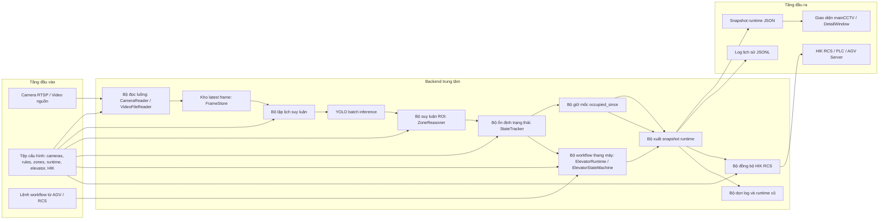

### 4.1. Ý nghĩa của sơ đồ tổng thể

Sơ đồ này cho thấy một tư duy rất quan trọng:

- luồng camera đi qua một trục xử lý trung tâm duy nhất
- các module không “đè” chồng trách nhiệm lên nhau
- workflow thang máy không chạm vào nhánh infer
- phần tích hợp ra ngoài chỉ tiêu thụ kết quả cuối cùng

## 5. Lưu đồ tổng thể cho một chu kỳ runtime

Đây là lưu đồ mô tả một vòng lặp xử lý đầy đủ của backend.

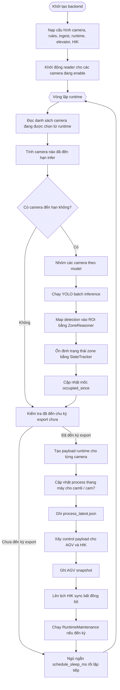

### 5.1. Điểm mấu chốt của vòng lặp runtime

- Infer và export là hai nhịp tách nhau.
- Không phải mỗi vòng lặp đều infer.
- Không phải mỗi frame đều được đưa đi xử lý.
- Export vẫn có thể tiếp tục chạy ngay cả khi không có infer mới trong đúng chu kỳ đó.
- HIK sync không được phép khóa vòng lặp chính.

## 6. Lưu đồ chi tiết tầng thu nhận dữ liệu

### 6.1. Mục tiêu kỹ thuật

- đọc luồng ổn định
- tự phục hồi khi camera lỗi
- luôn giữ frame mới nhất
- tránh tạo hàng đợi lớn gây trễ

### 6.2. Lưu đồ

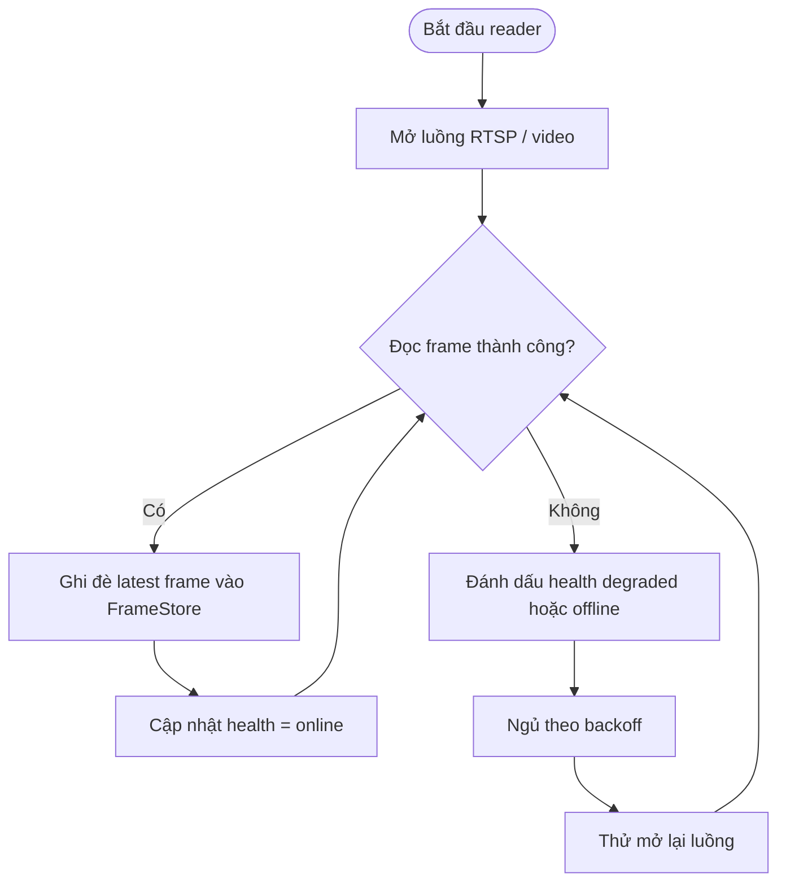

### 6.3. Ý nghĩa

- Nếu camera chậm, hệ thống không tích frame chờ.
- Nếu camera mất tín hiệu, backend không bị treo.
- Nếu camera phục hồi, luồng đọc tự quay lại.

Đây là tiền đề để toàn hệ thống chịu tải dài hạn.

## 7. Lưu đồ chi tiết bộ lập lịch suy luận

### 7.1. Mục tiêu kỹ thuật

- chỉ infer các camera thực sự đến hạn
- ưu tiên camera đang được operator mở chi tiết
- dùng GPU hợp lý
- không làm nghẽn vì cố infer tất cả cùng lúc

### 7.2. Lưu đồ

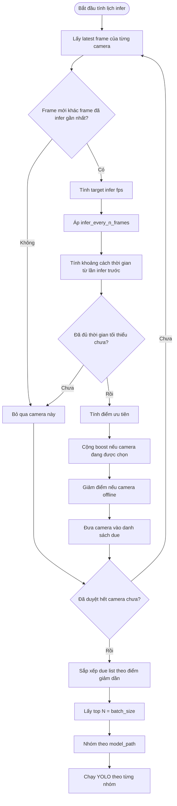

### 7.3. Ý nghĩa

Đây là một trong những điểm quyết định khả năng mở rộng của hệ thống:

- camera quan trọng có thể được ưu tiên
- camera ít quan trọng hơn sẽ không tranh tài nguyên vô tội vạ
- cùng một model được batch lại để tận dụng GPU

## 8. Lưu đồ chi tiết bộ suy luận ROI

### 8.1. Vai trò

`ZoneReasoner` nhận detection từ model và trả lời cho từng ROI:

- có object mục tiêu trong ROI hay không
- confidence khớp tốt nhất là bao nhiêu

Nó không quyết định nghiệp vụ, chỉ đóng vai trò “cảm biến hình học”.

### 8.2. Lưu đồ

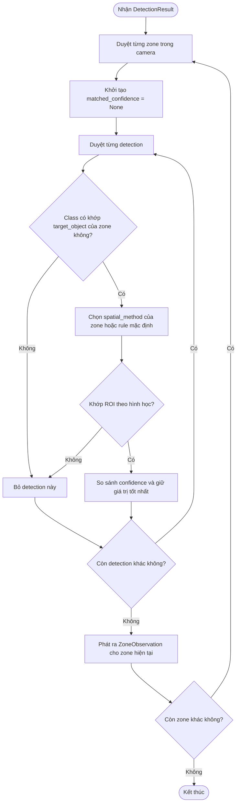

### 8.3. Ba cách khớp không gian

- `bbox_center`: tâm bbox nằm trong ROI
- `bbox_all_corners`: toàn bộ bbox phải nằm trong ROI
- `bbox_intersects`: bbox chỉ cần giao với ROI

Ý nghĩa:

- mỗi bài toán có thể chọn mức chặt khác nhau
- thang máy hiện dùng cách đủ nhạy để không bỏ lọt object trong cabin

## 9. Lưu đồ chi tiết bộ ổn định trạng thái zone

### 9.1. Vai trò

`StateTracker` biến observation liên tục thành trạng thái ổn định:

- `occupied`
- `empty`
- `unknown`

Nó giải quyết bài toán nhấp nháy do:

- detection trượt trong vài frame
- che khuất ngắn hạn
- overlap object
- infer không liên tục

### 9.2. Lưu đồ

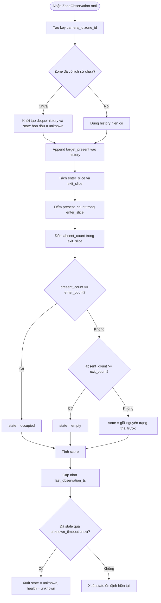

### 9.3. Ý nghĩa

Đây là nơi perception được nâng từ:

- “frame này có detection”

thành:

- “zone này hiện đang occupied một cách đáng tin”

Nếu không có lớp này, giao diện và tín hiệu ra ngoài sẽ rung rất mạnh.

## 10. Lưu đồ chi tiết logic `occupied_since`

### 10.1. Bài toán cần giải

Người vận hành cần biết:

- pallet hoặc trolley đã được đặt vào từ lúc nào

Nhưng nếu infer bị nghẽn ngắn, hoặc object bị che khuất thoáng qua, thì không được reset thời gian này sai.

### 10.2. Tư duy giải quyết

Hệ thống không xóa `occupied_since` ngay khi zone vừa chuyển `empty` hoặc `unknown`.

Thay vào đó:

- nếu `occupied`: giữ hoặc khởi tạo phiên occupied
- nếu `unknown`: giữ nguyên phiên occupied hiện có
- nếu `empty`: chỉ xóa khi `empty` kéo dài đủ lâu hơn `occupied_session_break_sec`

### 10.3. Lưu đồ

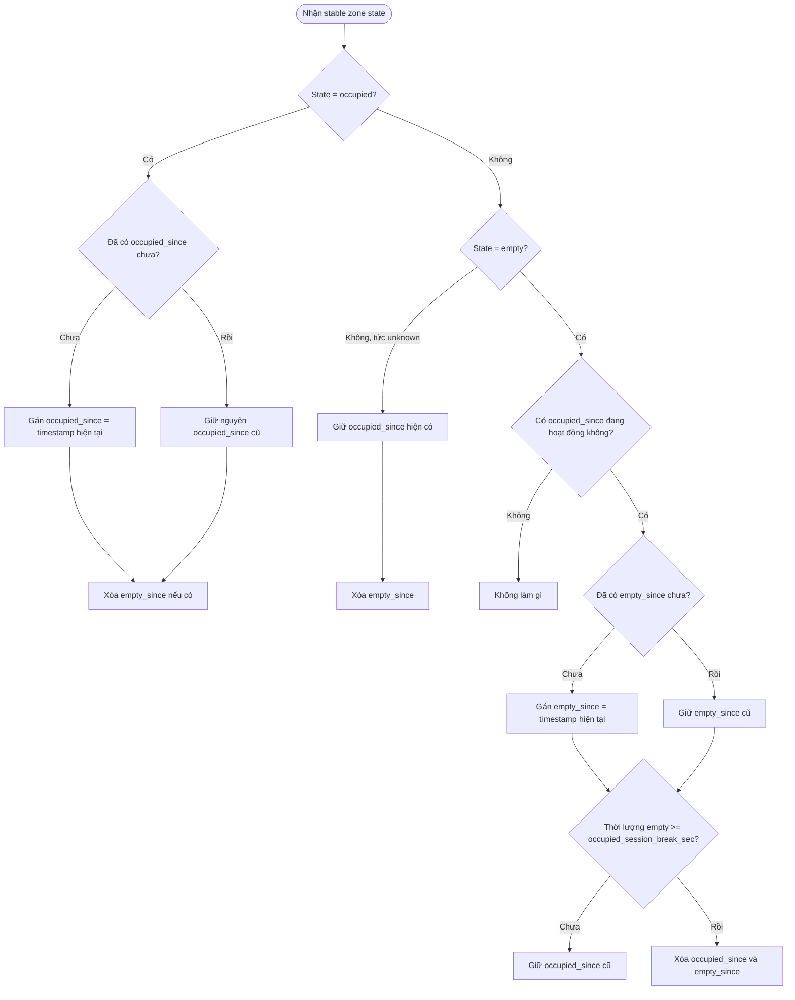

### 10.4. Ý nghĩa

Cơ chế này làm cho thời điểm “hàng được đặt vào” phản ánh phiên làm việc thực tế, không phản ánh các đứt đoạn ngắn do perception.

## 11. Lưu đồ tổng hợp phần xuất dữ liệu runtime

### 11.1. Vai trò

Sau khi có trạng thái ổn định, backend phải:

- ghi snapshot cho GUI
- cập nhật process thang máy
- tạo payload điều khiển cho AGV/HIK
- ghi log lịch sử

### 11.2. Lưu đồ

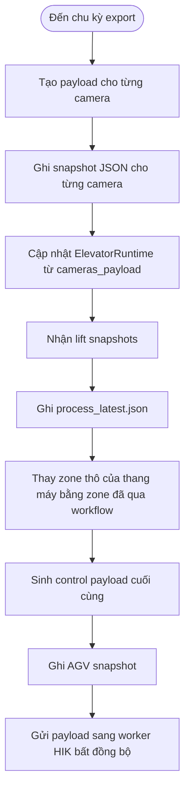

### 11.3. Ý nghĩa

Điểm rất quan trọng ở đây là:

- thang máy không còn phát tín hiệu occupancy thô nữa
- AGV và HIK nhận kết quả đã được state machine diễn giải

Đây là thay đổi mang tính kiến trúc, không chỉ là thay đổi hiển thị.

## 12. Lưu đồ tổng thể process thang máy

Đây là phần trọng tâm của bài toán workflow.

### 12.1. Mục tiêu

Process thang máy phải trả lời đúng các câu hỏi:

- cabin đã clear đủ ổn định để AGV vào chưa
- AGV đã được cấp quyền hay chưa
- đang ở giai đoạn nào của chu trình thang máy
- object đang thấy là bình thường hay bất thường
- có phải dừng vì intrusion hoặc fault không

### 12.2. Lưu đồ trạng thái tổng quát

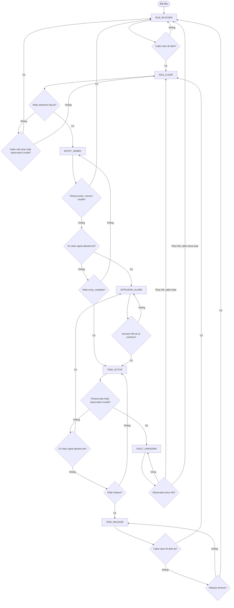

## 13. Lưu đồ chi tiết thuật toán cho process thang máy

### 13.1. Đầu vào của process thang máy

Mỗi chu kỳ export, process thang máy nhận:

- `camera_id`
- `camera_health`
- `timestamp`
- trạng thái zone cabin
- các class phát hiện được trong đúng ROI cabin
- command từ AGV/RCS

### 13.2. Đầu ra của process thang máy

Mỗi thang máy xuất:

- `lift_state`
- `entry_clear`
- `safety_ok`
- `intrusion_alarm`
- `fault_code`
- thông tin task hiện hành

### 13.3. Lưu đồ chi tiết theo từng bước

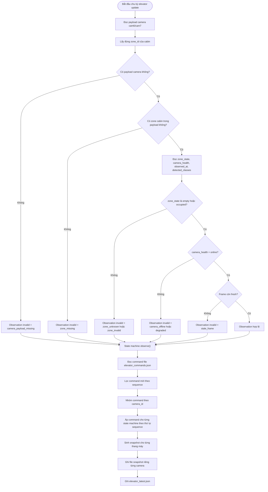

## 14. Bảng ý nghĩa các trạng thái thang máy

### 14.1. `IDLE_BLOCKED`

Ý nghĩa:

- cabin chưa đủ điều kiện để AGV vào

Nguyên nhân thường gặp:

- cabin đang có vật
- camera chưa sẵn sàng
- vừa khởi động
- vừa timeout release

### 14.2. `IDLE_CLEAR`

Ý nghĩa:

- cabin clear ổn định
- đây là trạng thái duy nhất cho phép nhận `authorize`

### 14.3. `ENTRY_ARMED`

Ý nghĩa:

- AGV/RCS đã xin quyền dùng thang máy
- hệ thống đang chờ AGV thực sự bước vào chu trình

### 14.4. `TASK_ACTIVE`

Ý nghĩa:

- AGV đã bước vào pha sử dụng thang máy
- workflow đang chạy
- chỉ cần giám sát intrusion hoặc fault

### 14.5. `INTRUSION_ALARM`

Ý nghĩa:

- trong ROI cabin đang thấy class ngoài allowed set
- hoặc đang xảy ra điều kiện bất thường trong pha robot workflow

### 14.6. `TASK_RELEASE`

Ý nghĩa:

- AGV đã được phép rời cabin
- hệ thống chờ cabin clear ổn định lại

### 14.7. `FAULT_UNKNOWN`

Ý nghĩa:

- không còn đủ chắc chắn để tiếp tục workflow
- phải về fail-safe

## 15. Lưu đồ tuần tự tổng thể của toàn hệ thống

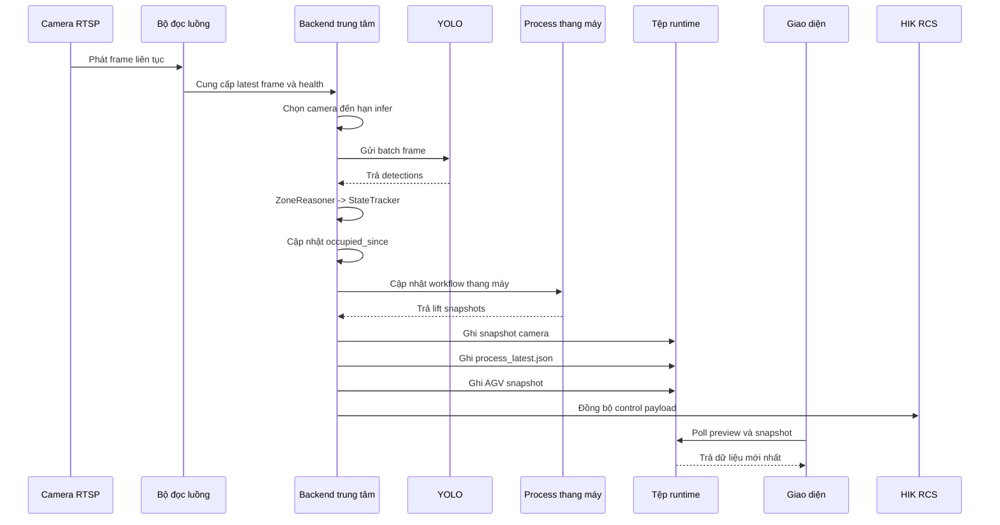

## 16. Lưu đồ tuần tự riêng cho giao diện giám sát

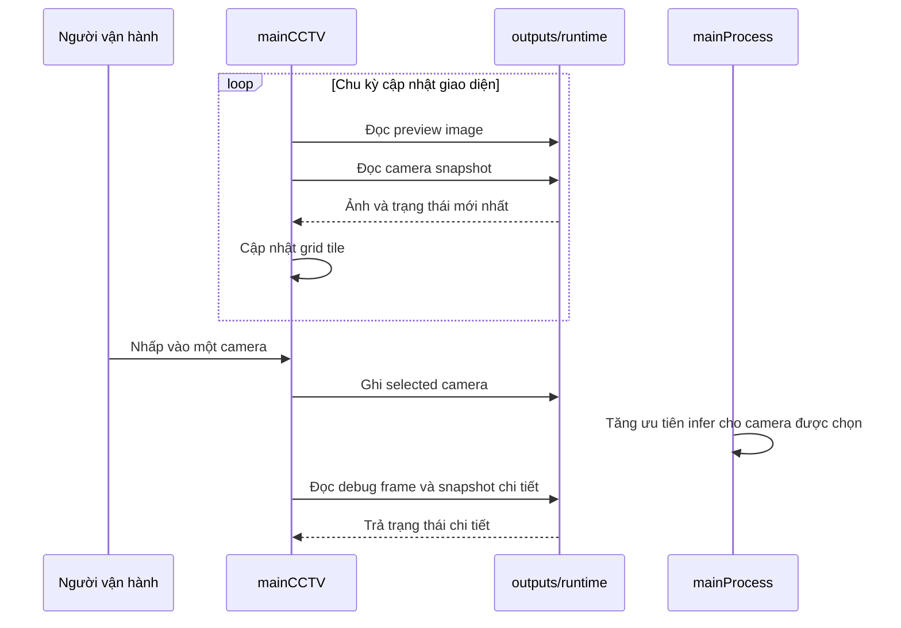

### 16.1. Ý nghĩa

- GUI không gánh xử lý thị giác
- GUI chỉ điều hướng nhu cầu quan sát của con người
- backend mới là nơi tối ưu tài nguyên và ra quyết định

## 17. Lưu đồ tuần tự riêng cho đồng bộ HIK bất đồng bộ

```mermaid
sequenceDiagram
    participant Loop as Vòng lặp export backend
    participant Queue as Bộ nhớ payload HIK
    participant Worker as Luồng HIK async
    participant HIK as HikRcsBridge

    Loop->>Queue: Ghi payload điều khiển mới nhất
    alt Chưa có worker chạy
        Queue->>Worker: Khởi động luồng sync
    end
    Worker->>Queue: Lấy payload mới nhất
    Queue-->>Worker: Trả payload mới nhất
    Worker->>HIK: Gọi sync(payload, timestamp)
    HIK-->>Worker: Gửi HTTP / nhận callback
    Worker->>Queue: Kiểm tra còn payload mới không
```

### 17.1. Ý nghĩa

- backend không bị chặn bởi độ trễ mạng hoặc HTTP
- chỉ giữ payload mới nhất, tránh xếp hàng lệnh cũ
- đây là cách bảo vệ vòng lặp chính khỏi nghẽn ngoài ý muốn

## 18. Lưu đồ tuần tự riêng cho process thang máy

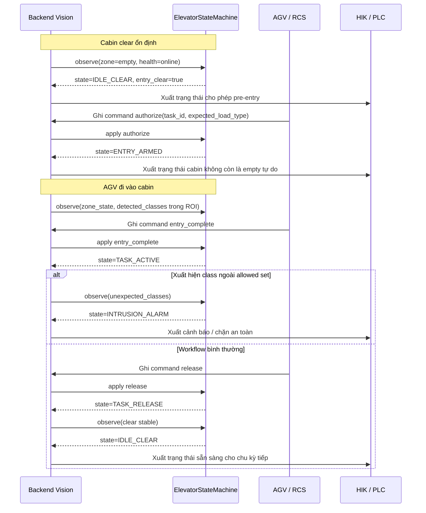

## 19. Lưu đồ quyết định điều khiển cuối cùng cho zone thang máy

Đây là lưu đồ cực quan trọng vì nó mô tả cách thang máy được map từ workflow sang tín hiệu ra ngoài.

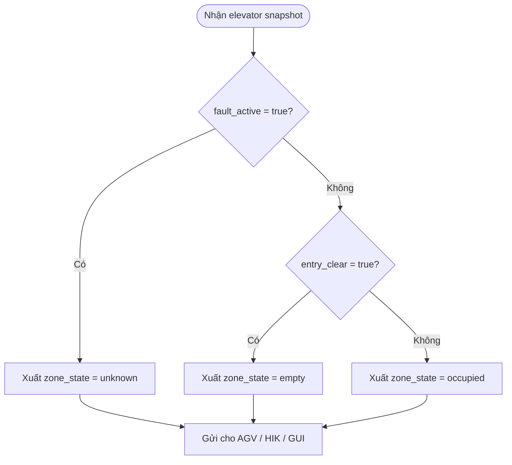

### 19.1. Ý nghĩa

Nó cho thấy:

- `empty` của thang máy không còn là empty theo perception đơn thuần
- `empty` bây giờ là empty theo workflow an toàn

Đây chính là điểm nâng cấp quan trọng nhất của bài toán thang máy.

## 20. Lưu đồ dọn log và dữ liệu runtime cũ

### 20.1. Mục tiêu

Hệ thống chạy liên tục nhiều giờ, nhiều ngày. Nếu không dọn log:

- file sẽ phình rất lớn
- I/O sẽ nặng dần
- có nguy cơ ngốn bộ nhớ lưu trữ

### 20.2. Lưu đồ

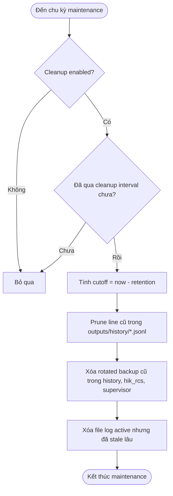

## 21. Bức tranh đầy đủ về trách nhiệm của từng module

### 21.1. `mainProcess.py`

Trách nhiệm:

- điều phối toàn bộ runtime
- quản lý worker camera
- batch infer
- export runtime
- gọi process elevator
- gọi HIK sync
- chạy maintenance

### 21.2. `core/zone_reasoner.py`

Trách nhiệm:

- chuyển detection thành observation cho từng ROI

### 21.3. `core/state_tracker.py`

Trách nhiệm:

- làm mượt `occupied / empty / unknown`

### 21.4. `core/elevator_state_machine.py`

Trách nhiệm:

- diễn giải workflow thang máy
- xử lý command `authorize`, `entry_complete`, `release`, `continue`, `cancel`
- phát hiện intrusion theo policy class
- fail-safe khi timeout hoặc observation invalid

### 21.5. `core/elevator_runtime.py`

Trách nhiệm:

- đọc camera payload
- dựng observation thang máy
- đọc command file
- cập nhật các state machine
- ghi snapshot thang máy

### 21.6. `mainCCTV.py`

Trách nhiệm:

- đọc snapshot và ảnh preview
- hiển thị lên giao diện
- cho người dùng chọn camera cần theo dõi chi tiết

### 21.7. `core/runtime_maintenance.py`

Trách nhiệm:

- giới hạn tăng trưởng log và output runtime

## 22. Kết luận kiến trúc

Nếu phải cô đọng toàn bộ hệ thống trong một câu:

Đây là một hệ thống Vision trung tâm được thiết kế theo tư duy `khung hình mới nhất -> suy luận theo lịch -> ánh xạ ROI -> ổn định trạng thái -> chồng workflow nghiệp vụ -> tích hợp bất đồng bộ`, với mục tiêu đồng thời đạt được ba yêu cầu: đúng nghiệp vụ, fail-safe công nghiệp, và tiết kiệm tài nguyên để mở rộng nhiều camera.

## 23. Các tệp tham chiếu chính

- Backend trung tâm: [mainProcess.py](/C:/Users/longn/PyCharmMiscProject/PIDVN25006/mainProcess.py)
- Giao diện giám sát: [mainCCTV.py](/C:/Users/longn/PyCharmMiscProject/PIDVN25006/mainCCTV.py)
- Suy luận ROI: [core/zone_reasoner.py](/C:/Users/longn/PyCharmMiscProject/PIDVN25006/core/zone_reasoner.py)
- Ổn định trạng thái: [core/state_tracker.py](/C:/Users/longn/PyCharmMiscProject/PIDVN25006/core/state_tracker.py)
- Workflow thang máy: [core/elevator_state_machine.py](/C:/Users/longn/PyCharmMiscProject/PIDVN25006/core/elevator_state_machine.py)
- Runtime thang máy: [core/elevator_runtime.py](/C:/Users/longn/PyCharmMiscProject/PIDVN25006/core/elevator_runtime.py)
- Dọn runtime cũ: [core/runtime_maintenance.py](/C:/Users/longn/PyCharmMiscProject/PIDVN25006/core/runtime_maintenance.py)
- Tài liệu process thang máy: [docs/elevator_process_vi.md](/C:/Users/longn/PyCharmMiscProject/PIDVN25006/docs/elevator_process_vi.md)
